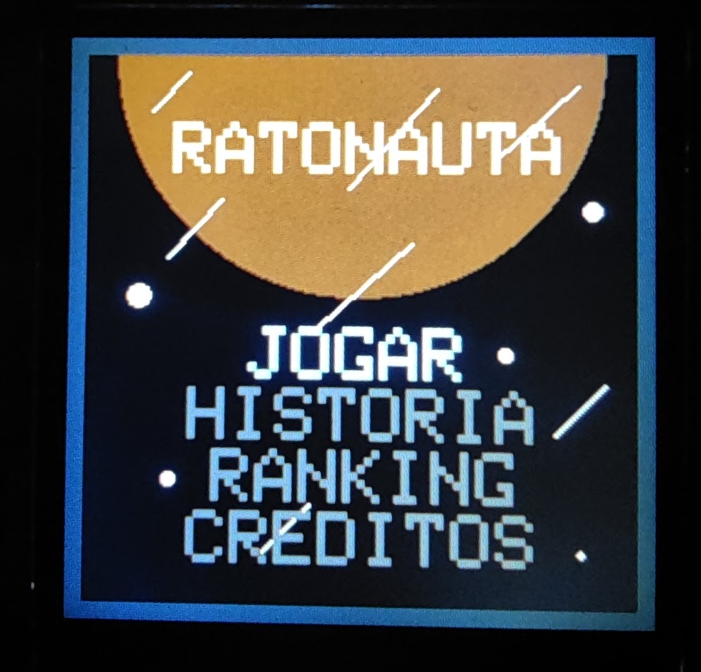

# RATONAUTA

Projeto com intuito de aprender programação e raciocínio lógico: 
. Desenvolvimento de documentos de design de jogo;
. Criação de protótipos mínimos viáveis de jogos;
. Desenvolvimento de jogos simples para o Arduino..

Sobre:
O projeto é um jogo de plataformas com tema espacial, no qual o personagem principal é um rato que deseja conquistar a Lua, 
supostamente feita de queijo, para comê-la. O jogador deve ajudar o rato a saltar entre as plataformas e coletar recompensas 
enquanto recupera seu oxigênio gradativamente conforme a velocidade dos movimentos. As habilidades de atenção e reflexos do jogador 
são continuamente testadas durante o jogo. O jogo possui uma animação de abertura com o rato observando a Lua feita de queijo, 
seguida do menu com as opções de Jogar, Tutorial e Loja. A atmosfera dinâmica é criada pelos elementos como fundos espaciais, bases de meteoros flutuantes, 
tanques de oxigênio e estrelas como prêmios para serem coletados. As mecânicas de jogo incluem a barra de oxigênio do rato que decai com o tempo e 
pode ser recuperada por saltos ou cilindros de oxigênio, a possibilidade de pular sobre plataformas sólidas e suspensas e a geração aleatória das 
plataformas com controle de acessibilidade. A história do jogo segue o rato em sua jornada para alcançar a Lua feita de queijo, enfrentando obstáculos 
e desafios pelo caminho.

## Veja o desenvolvimento do projeto:

## 🤝 Contribuição

Projeto aberto para ajuda!

Lembre de seguir os requisitos da licensa...

## 🔖 Licensa

## 💰 Donate
PIX: a4eabcdd-1899-48cc-b751-bfd8bb92e96e (chave aleatoria)

Copyright © 2022 Guilherme Franchin

